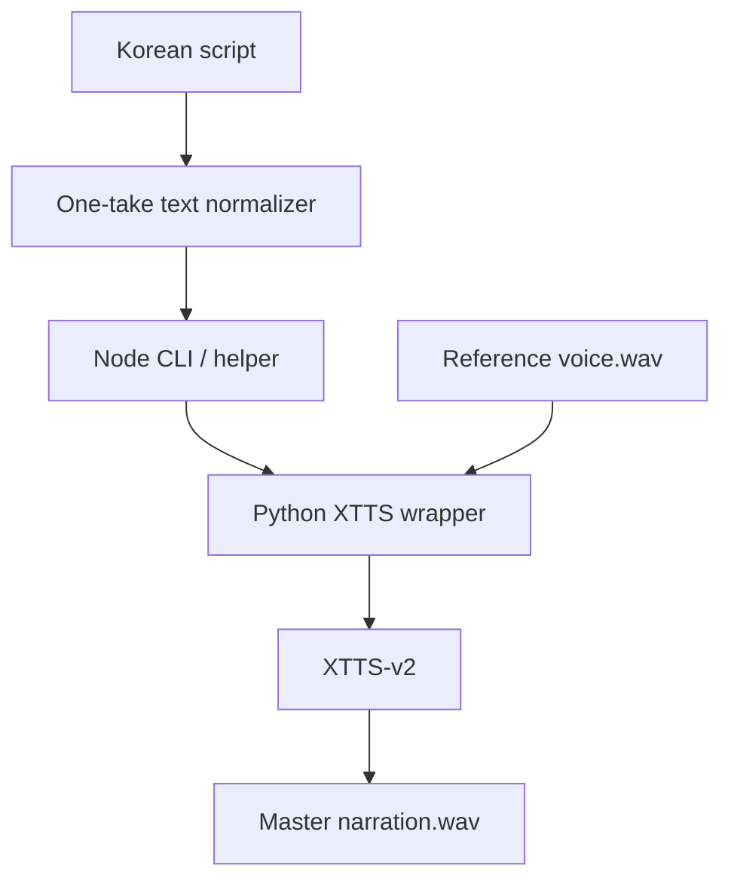

# Local Korean XTTS Engine

[한국어 README](./README.md)

This repository is a `local Korean-first one-take XTTS-v2 engine` for shorts narration.

Goals:

- keep your own voice reference
- generate Korean narration with a stronger sentence flow
- stay reproducible on a local machine instead of depending on external SaaS workflows

This repository does **not** include any private voice assets.  
You must provide your own reference WAV.

## Why this exists

Many multilingual TTS setups still fail in Korean with issues like:

- pronunciation that sounds closer to another language
- token-like pacing instead of sentence-level phrasing
- noisy tails
- awkward service policies around saving and re-editing generated speech

This project focuses on `Korean text normalization + XTTS-v2 + local one-take generation`.

## Architecture



## Included

- `src/index.ts`
  One-take Korean normalization and Python wrapper execution
- `src/cli.ts`
  Runnable Node CLI
- `scripts/local_korean_xtts.py`
  XTTS-v2 inference wrapper
- `scripts/setup_local_korean_tts.ps1`
  Windows runtime bootstrap script

## Quick start

### 1. Install runtime

```powershell
pwsh -ExecutionPolicy Bypass -File .\scripts\setup_local_korean_tts.ps1
```

Verified combination in this repo:

- Python 3.11
- `torch 2.11.0+cu128`
- `TTS==0.22.0`
- `transformers==4.41.2`

### 2. Prepare a reference WAV

Recommended:

- at least 10 seconds
- clear Korean speech
- no background music

### 3. Generate narration

```powershell
npm install
npm run synth -- --text-file .\examples\sample-script.ko.txt --output .\out.wav --reference C:\path\to\reference.wav
```

## Design notes

- One speaker body narration should be generated as a single master track first.
- Korean cleanup should happen before model inference.
- The Python wrapper patches XTTS audio loading to avoid Windows `torchaudio/torchcodec` issues and uses `soundfile` for reference loading.

## Safety

- Only use voices you are authorized to use.
- Do not push private voice references into a public repository.

