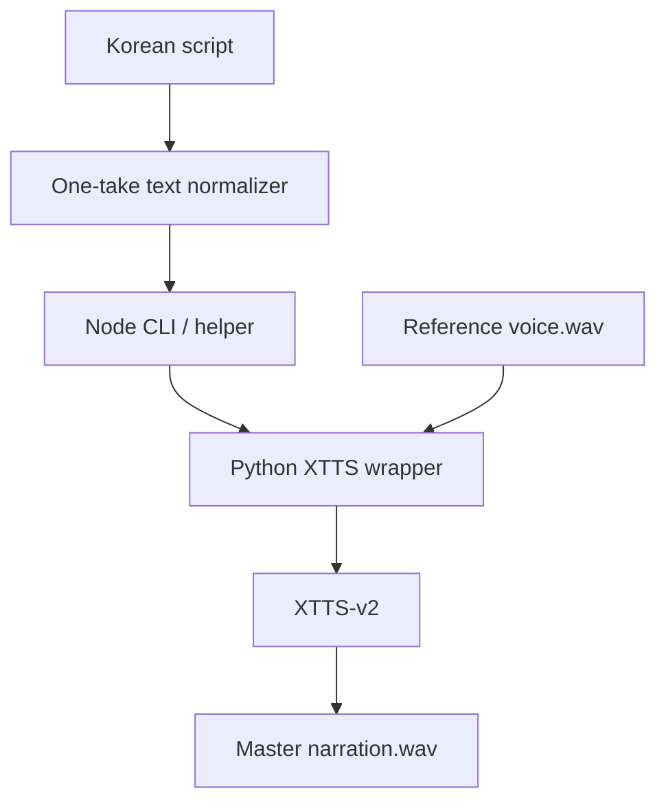
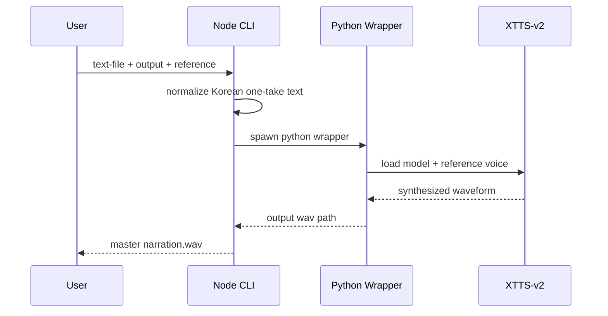

# 로컬 한국어 XTTS 엔진

[English README](./README.en.md)

한국어 숏츠 내레이션을 위해 만든 `로컬 one-take XTTS-v2 엔진`입니다.  
핵심 목표는 세 가지입니다.

- 내 목소리 reference를 그대로 쓴다
- 한국어 호흡을 살린 one-take 본문을 만든다
- 외부 SaaS 정책에 덜 묶이고, 로컬에서 재현 가능하게 돌린다

이 저장소는 `민감한 사용자 음성 자산`을 포함하지 않습니다.  
직접 준비한 reference WAV를 넣어 사용해야 합니다.

## 왜 이 프로젝트가 필요한가

기존 멀티링구얼 TTS는 한국어에서 이런 문제가 자주 생깁니다.

- 중국어처럼 들리는 발음
- 문장보다 토큰 단위로 끊기는 호흡
- 말끝 잡음과 tail artifact
- 외부 서비스 정책 때문에 저장, 편집, 재렌더가 불편한 구조

이 프로젝트는 `한국어 전처리 + XTTS-v2 + 로컬 one-take` 조합으로 그 문제를 줄이는 데 초점을 둡니다.

## 구조



## 포함된 것

- `src/index.ts`
  한국어 one-take 정형화와 Python wrapper 호출
- `src/cli.ts`
  바로 실행 가능한 Node CLI
- `scripts/local_korean_xtts.py`
  XTTS-v2 inference wrapper
- `scripts/setup_local_korean_tts.ps1`
  Windows용 런타임 설치 스크립트

## 빠른 시작

### 1. 런타임 설치

```powershell
pwsh -ExecutionPolicy Bypass -File .\scripts\setup_local_korean_tts.ps1
```

기본값:

- Python 3.11 전용 가상환경 `.venv-local-korean-tts`
- CUDA 경로면 `torch 2.11.0+cu128`
- `TTS==0.22.0`
- `transformers==4.41.2`

### 2. reference WAV 준비

권장:

- 10초 이상
- 배경음악 없는 mono/stereo WAV
- 한국어 발음이 또렷한 음성

### 3. 합성 실행

```powershell
npm install
npm run synth -- --text-file .\examples\sample-script.ko.txt --output .\out.wav --reference C:\path\to\reference.wav
```

추가 옵션:

- `--speed 1.13`
  숏츠 기준 원래 레퍼런스의 말하기 속도를 direct synth 결과에도 그대로 반영합니다.
- `--max-line-length 26`
  한국어 clause를 더 짧게 끊어 자막과 호흡용 줄바꿈을 더 보수적으로 잡습니다.
- `--no-tail-cleanup`
  말끝 tail cleanup을 끄고 raw XTTS 출력에 가깝게 확인할 때 사용합니다.

## CLI 예시

```powershell
npm run synth -- `
  --text-file .\examples\sample-script.ko.txt `
  --output .\out.wav `
  --reference C:\voices\boss-reference.wav `
  --device cuda `
  --speed 1.13 `
  --max-line-length 24
```

## 설계 원칙

### 1. one-take 우선

같은 화자가 이어지는 본문은 scene별 TTS를 이어붙이지 않습니다.  
먼저 `master narration.wav`를 만들고, 영상 컷은 그 뒤에 맞춥니다.

### 2. 한국어 전처리는 엔진 앞단에서 해결

- 줄바꿈 정리
- 다중 공백 정리
- 문장 종결부 정리
- one-take에 맞는 최소한의 문장 흐름 보존

### 3. Windows 실전 호환성

이번 저장소에서는 아래 조합으로 실제 검증했습니다.

- Windows
- Python 3.11
- XTTS-v2
- `transformers==4.41.2`
- PyTorch 2.11 계열

또한 XTTS 내부의 `torchaudio.load()` 경로가 Windows에서 `torchcodec` 문제를 일으킬 수 있어, wrapper에서 `soundfile` 기반 로더로 우회합니다.

## 시스템 이해용 다이어그램



## 주의 사항

- 이 저장소는 `음성 복제의 책임 있는 사용`을 전제로 합니다.
- 본인이 권한을 가진 음성만 사용하세요.
- 공개 저장소에 reference WAV를 함께 올리지 마세요.

## 다음 단계

- 긴 한국어 문장을 더 안전하게 처리하는 clause chunker
- F5-TTS backend adapter
- ffmpeg 후처리 preset 내장
